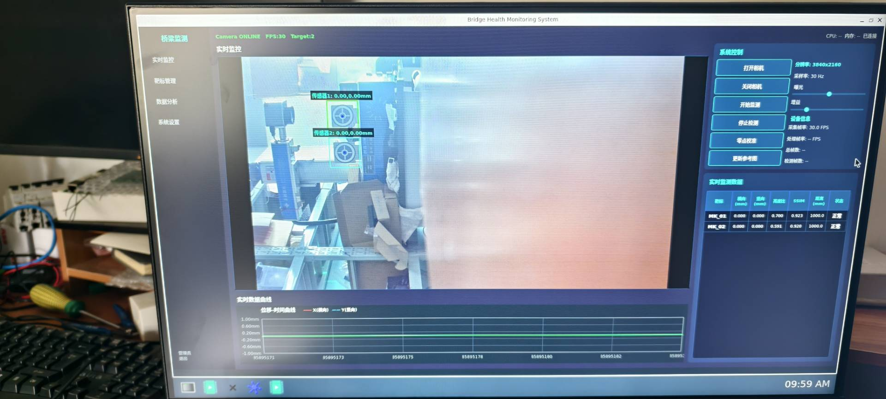
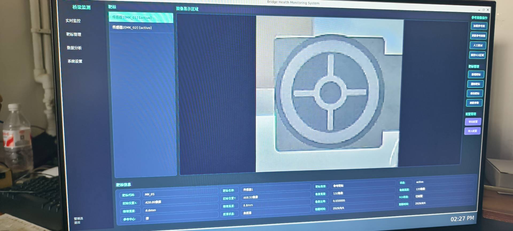
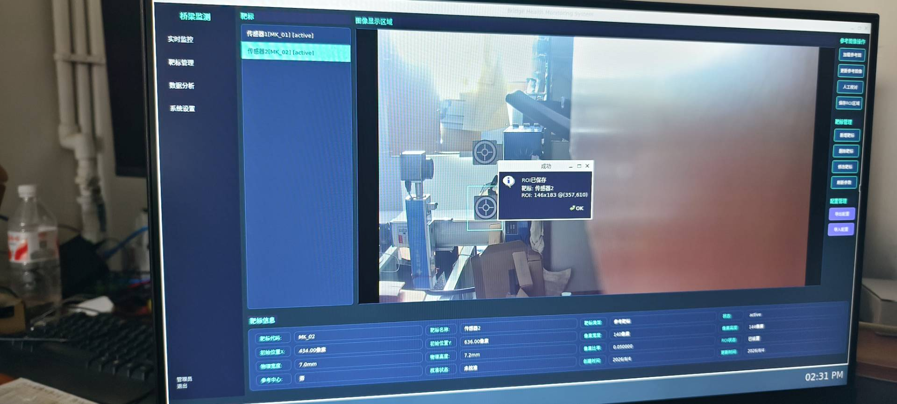
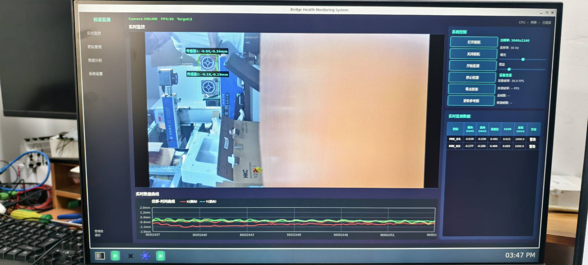
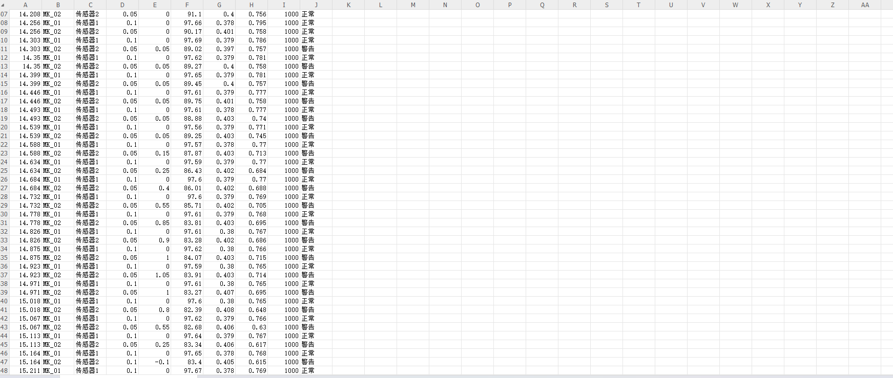

# Bridge Displacement Monitor

基于 Qt + OpenCV + Linux V4L2 的工业结构健康监测上位机系统，面向桥梁/建筑位移的实时视觉测量场景。支持相机标定、滑动平均滤波平滑、在线质量评估与多级状态预警。

## 项目概述

系统通过 V4L2 采集工业相机视频流，利用 OpenCV 模板匹配算法实时追踪靶标位移，集成 **张正友相机标定** 实现像素-物理尺度自动转换，引入 **多帧滑动平均滤波** 抑制模板匹配随机抖动，通过 **StatusAnalyzer** 实现在线质量评估与分级预警。在 Qt GUI 上同步显示视频画面与位移时序曲线，支持靶标管理、零点校准与数据导出。基础版本已在 RK3576 嵌入式平台（ARM64）完成运行验证，当前版本在此基础上增加相机标定、滑动平均滤波及状态评估模块。

## 功能特性

- [x] V4L2 MMAP 多缓冲视频采集（NV12 → RGB，零拷贝）
- [x] 实时图像显示与交互式 ROI 框选（鼠标拖拽 + 事件过滤器）
- [x] OpenCV 模板匹配靶标跟踪（NCC，置信度 ≥ 0.55）
- [x] 亚像素级位移跟踪（抛物线插值，低像素比场景精度提升）
- [x] **相机标定模块**（张正友标定法，`calibrateCamera` + `cornerSubPix`），支持内参/畸变系数计算与 YAML 持久化
- [x] **像素-物理尺度动态转换**（基于标定参数 `pixelToMM`，替代固定比例系数）
- [x] **滑动平均滤波位移平滑**（5 帧时序窗口，约 150 ms，抑制模板匹配随机抖动）
- [x] **在线质量评估与状态预警**（`StatusAnalyzer`：置信度/SSIM/亮度/位移突变多级分级：正常/警告/异常）
- [x] 图像去畸变支持（`initUndistortRectifyMap` + `remap`，预计算映射表加速）
- [x] 零点校准与参考图像动态更新
- [x] 实时位移曲线绘制（QPainter 自绘，X/Y 双通道，零第三方图表依赖）
- [x] 监测数据 CSV 自动导出（含状态字段）
- [x] 靶标管理（增删改、参数配置 JSON 导入导出、标定状态显示）
- [x] 深色工业主题界面（QSS 自定义）

## 技术栈

| 层级 | 技术 |
|------|------|
| GUI 框架 | Qt 6 (QWidget, 信号槽, 自定义事件过滤器, QPainter) |
| 视觉算法 | OpenCV 4.x (模板匹配, 亚像素插值, `calib3d`) |
| 视频采集 | Linux V4L2 API (MMAP 零拷贝, 多缓冲队列) |
| 标定 | 张正友标定 (`findChessboardCorners`/`calibrateCamera`) |
| 数据持久化 | YAML (标定参数) / JSON (靶标配置) / CSV (监测日志) |
| 硬件平台 | RK3576 (ARM64) + Sony IMX415 工业相机 |
| 构建工具 | qmake |

## 系统架构

[工业相机] --V4L2/MMAP--> [VideoWidget]
|
|--[CalibrationManager]--> camera.yaml (标定参数)
|--[SlidingAverage]---------> 位移平滑
|--[StatusAnalyzer]--------> 状态预警
|
[TargetManager] <---> [MainWindow]
|
[PlotWidget] --QPainter--> [UI 显示]
|
[CSV 日志]

## 核心实现细节

- **V4L2 高效采集**：使用 4 缓冲队列 + `mmap` 零拷贝，避免 `read()` 额外内存拷贝；NV12 通过 OpenCV 转 RGB 后渲染
- **ROI 交互设计**：基于 `eventFilter` 拦截 `QLabel` 鼠标事件，实现图像坐标与控件坐标的双向映射，支持动态框选与实时回显
- **模板匹配优化**：限定搜索区域为 ROI 邻域（±80px），避免全图遍历；匹配成功后自动更新 ROI 位置实现跟踪。搜索区域缩减约 1~2 个数量级（1920×1080 → 邻域窗口）
- **亚像素插值**：基于抛物线拟合的亚像素定位，结合多帧滑动平均滤波（5 帧时序窗口，约 150 ms）抑制随机抖动，长期监测稳定性提升（当前采用滑动平均抑制高频噪声，后续可扩展为自适应加权平均或卡尔曼滤波以支持动态振动分析）
- **相机标定与尺度转换**：集成 `calibrationmanager`，支持 `findChessboardCorners` → `cornerSubPix` → `calibrateCamera` 标准流程，计算相机内参、畸变系数与像素尺度；运行时通过 `camera.yaml` 加载预标定参数，实现像素到毫米的自动转换，替代硬编码 `mmPerPixel`
- **在线质量评估**：`StatusAnalyzer` 基于置信度、SSIM 结构相似度、ROI 亮度比及位移突变检测，实现模板漂移、光照异常、置信度下降的实时分级预警（正常/警告/异常）
- **跨线程数据流**：视频采集/检测逻辑通过 Qt 信号槽（`targetUpdated`）与 UI 主线程解耦，避免界面卡顿
- **自绘曲线控件**：`PlotWidget` 基于 `QPainter` 自绘，支持多靶标、多时间窗口、自动量程缩放，零第三方依赖

## 编译运行

### 环境要求

- OS: Linux (Ubuntu 20.04+ / 嵌入式 Buildroot)
- Arch: ARM64 (RK3576) / x86_64
- Qt: 5.15+ / 6.x
- OpenCV: 4.5+（需包含 `calib3d` 模块）

### 编译

# 1. 若使用 RK SDK 中的 OpenCV，先设置环境变量
export RK_SDK_PATH=/path/to/rk3576-sdk/.../3rdparty

# 2. 构建
cd bridge_monitor
qmake bridge_monitor.pro
make -j$(nproc)

# 3. 运行（需相机设备 /dev/video33）
./bridge_monitor

若在其他 Linux 平台编译，请确保 pkg-config 能找到 OpenCV，或手动修改 .pro 中的 RK_SDK_PATH。

## 使用说明

1. **准备标定参数（可选）**：将标定得到的 camera.yaml 放置于程序同级目录，系统将自动加载内参与像素尺度；若未提供，则回退至默认比例系数
2. **打开相机**：点击"打开相机"，等待图像显示
3. **框选靶标**：在图像上按住鼠标左键拖拽框选黑白标靶区域，输入名称后保存
4. **开始监测**：点击"开始监测"，程序自动跟踪靶标并计算位移
5. **零点校准**：移动靶标到基准位置后，点击"零点校准
6. **查看曲线**：下方实时显示 X（实线）/ Y（虚线）位移曲线
7. **数据导出**：监测开始后自动保存 CSV 到程序目录，含位移、置信度、SSIM、亮度、状态字段
8. **靶标管理**：左侧菜单切换"靶标管理"，可修改参数、更新参考图像、查看标定状态等

## 项目结构

| 文件目录 | 职责 |
|------|------|
| `videowidget.cpp/h` | V4L2 采集、OpenCV 模板匹配、ROI 交互、滑动平均滤波集成、CSV 导出 |
| `plotwidget.cpp/h` | 实时位移曲线自绘控件（QPainter） |
| `targetmanager.cpp/h` | 靶标列表管理、ROI 框选、配置导入导出 |
| `target.h` | 靶标数据结构（ROI、模板图、位移、像素比、标定状态等） |
| `mainwindow.cpp/h/ui` | 主界面布局、页面切换、信号连接 |
| `calibrationmanager.cpp/h` | 相机标定管理（张正友标定、YAML 读写、去畸变、像素尺度转换） |
| `slidingaverage.cpp/h` | 滑动平均滤波位移平滑（多帧时序窗口，按靶标 ID 独立跟踪） |
| `statusanalyzer.cpp/h` | 在线质量评估与分级状态预警 |
| `camera.yaml` | 标定参数文件（相机内参、畸变系数、像素尺度） |
| `style.qss` | 深色工业主题样式表 |

### 标定参数文件示例

`camera.yaml`（**以下为示例格式，实际部署时需自行拍摄棋盘格标定得到真实参数**）：

```yaml
%YAML:1.0
---
camera_matrix: !!opencv-matrix
  rows: 3
  cols: 3
  dt: d
  data: [ 1.8e+03, 0., 9.6e+02, 0., 1.8e+03,
          5.4e+02, 0., 0., 1. ]
distortion_coefficients: !!opencv-matrix
  rows: 1
  cols: 5
  dt: d
  data: [ -2.8e-01, 9.5e-02, 0., 0., -1.3e-02 ]
image_width: 1920
image_height: 1080
pixel_scale: 0.05
focal_length: 1800.0
calibrated: 1
```  
**注**：标定为一次性工作，参数文件可持久化复用。现场部署时无需重新标定，直接加载 camera.yaml 即可。

## 演示截图

<details>
<summary>点击查看更多截图</summary>







**注**：以上为系统早期版本运行截图，当前代码版本新增相机标定模块（CalibrationManager）与滑动平均滤波，靶标信息面板将自动显示标定状态与精确像素尺度。

</details>

## 注意事项

- 默认相机设备 `/dev/video33`，如需修改请编辑 `videowidget.cpp`
- 默认分辨率 1920×1080，格式 NV12
- 模板匹配阈值 0.55，可根据实际场景调整
- 标定参数：程序启动时自动尝试加载 camera.yaml（或指定路径），若加载失败则使用默认像素比例 0.05 mm/pixel
- 靶标管理界面可查看每个靶标的"校准状态"（已标定/未标定）

## 性能参考

| 指标 | 说明 |
|------|------|
| `视频采集帧率` | 	30 fps (1920×1080) |
| `ROI 搜索策略` | 全图搜索 → ±80px 邻域限制，搜索区域缩减约一个数量级 |
| `位移平滑` | 引入滑动平均滤波（5 帧时序窗口，约 150 ms）抑制模板匹配随机抖动 |
| `定位精度` | 	亚像素级（抛物线插值 + 标定参数动态转换） |

## 后续优化方向

- 模板匹配迁移至 RKNN NPU 推理，降低 CPU 占用
- 引入多线程解码，分离 V4L2 采集与算法检测线程
- 增加 SQLite 本地数据库替代 CSV，支持历史数据查询
- 支持 ONVIF 网络相机接入
- 多相机同步采集与分布式靶标管理

## License

This project is licensed under the MIT License.


